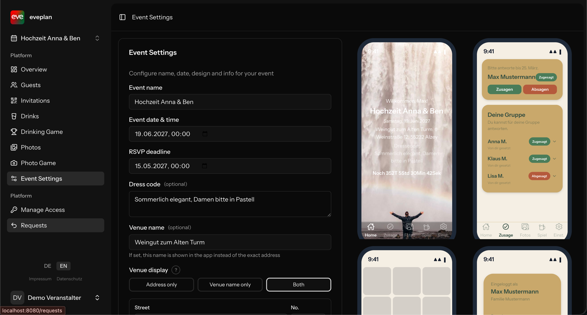
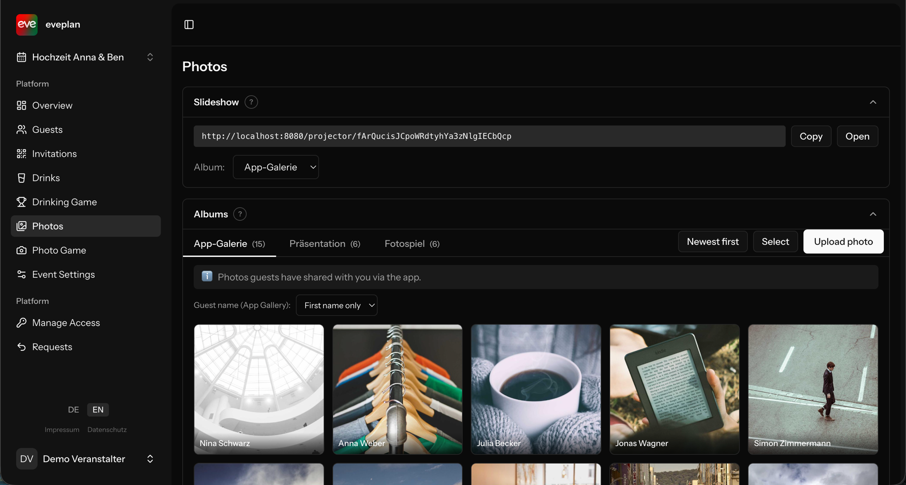
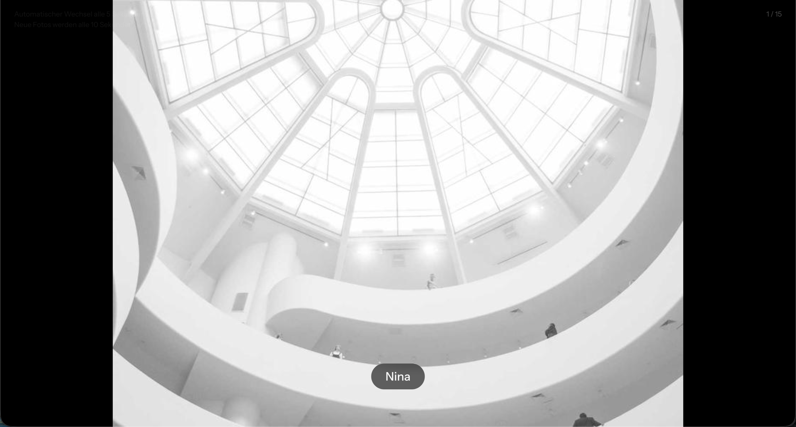

# Eventplaner

[](https://github.com/AHommrich/eventplaner/actions/workflows/tests.yml)
[](https://github.com/AHommrich/eventplaner/actions/workflows/lint.yml)
[](https://github.com/AHommrich/eventplaner/actions/workflows/e2e.yml)
[](LICENSE)

Wedding and event planner built as a Progressive Web App with a React Native companion: guest management, RSVPs, photo uploads, a drinking game, a photo game, and a token-protected projector slideshow for the actual party.

> Auch auf Deutsch verfügbar: [README.de.md](README.de.md)







---

## Feature highlights

Sorted from "technically interesting" to "UX polish". Each item links to the central file that implements the mechanism.

1. **QR login for guests** — Sanctum bearer tokens via QR code. Solo guests receive the token directly; family groups first pick a member so unused tokens don't block other family members.
   → [`app/Http/Controllers/Api/QrAuthController.php`](app/Http/Controllers/Api/QrAuthController.php)

2. **Photo game with a delta-override model** — global task catalogs (general + event-type specific) plus per-event overrides (`hidden` / `modified` / `added`). The standard tasks stay maintainable in a single place; events only store deltas.
   → [`app/Http/Controllers/Api/PhotoGameController.php`](app/Http/Controllers/Api/PhotoGameController.php)

3. **Drinking-game scoring with physiologically motivated multipliers** — base formula `liters × % × 10`, shot multiplier 2.0 for spirits (faster absorption), 50% binge penalty after three alcoholic drinks in a row, negative points for water and soft drinks.
   → [`app/Services/DrinkScoreService.php`](app/Services/DrinkScoreService.php)

4. **Configurable color system with live preview** — three palette slots (primary/secondary/tertiary) and nine role fields that store keys rather than hex values. Change the palette and every role follows. Four simulated app screens react live in the settings split-screen.
   → [`resources/js/pages/Event/Settings.vue`](resources/js/pages/Event/Settings.vue)

5. **Clean drink-catalog modeling** — one row per drink type in `drink_catalog`, one row per size in `drink_catalog_sizes`, the per-event selection in `drinks` references both. `drink_logs` keep `amount_liter` denormalized so historic points stay stable.
   → [`app/Models/DrinkCatalog.php`](app/Models/DrinkCatalog.php), [`database/migrations/2026_03_29_000001_refactor_drink_catalog_to_type_only.php`](database/migrations/2026_03_29_000001_refactor_drink_catalog_to_type_only.php)

6. **Projector slideshow** — public route gated by `projector_token`, auto-polls every 10 s, 5 s crossfade. Context label per album: guest name (gallery), description (presentation) or task text (photo game).
   → [`resources/js/pages/Projector/Show.vue`](resources/js/pages/Projector/Show.vue)

7. **Style presets for one-click theme switching** — predefined palettes can be applied to an event without touching individual fields.
   → [`app/Http/Controllers/EventStylePresetController.php`](app/Http/Controllers/EventStylePresetController.php)

8. **Mobile PWA** — installable on iOS/Android, custom icon set, offline support via `vite-plugin-pwa`.
   → [`vite.config.ts`](vite.config.ts)

9. **i18n on the front- and backend** — vue-i18n v11 for the web app, `Accept-Language` middleware for API responses so the React Native app gets localized drink and photo-game texts.
   → [`resources/js/plugins/i18n.ts`](resources/js/plugins/i18n.ts)

10. **Public landing page** — three-step explainer and feature cards for first-time visitors, no auth required.
    → [`resources/js/pages/Welcome.vue`](resources/js/pages/Welcome.vue)

---

## Tech stack

| Layer | Technology |
|---|---|
| Backend | Laravel 12 (PHP 8.3) + Inertia.js + Sanctum |
| Web frontend | Vue 3 + TypeScript + Tailwind CSS 4 + Reka UI |
| Mobile | React Native (Expo) — [separate repository](https://github.com/AHommrich/eventplaner-app) |
| Build | Vite 6 + `vite-plugin-pwa` |
| Storage | Hetzner Object Storage (photos, Nürnberg) |
| Mail | Resend |
| Deploy | Docker + Coolify |

---

## Quick start

The project is fully containerized. Migrations run automatically on boot.

```bash
docker compose up -d
```

Promote the initial admin user inside the running container:

```bash
docker exec laravel-app php artisan tinker
# > User::where('email', 'you@example.com')->update(['role' => 'admin'])
```

Vite runs in its own container and serves assets over HMR.

---

## Deploy workflow

Three long-lived branches, each auto-deployed by Coolify on push. Migrations run automatically.

| Branch | Environment | Domain | Dockerfile |
|---|---|---|---|
| `develop` | local dev | — | `Dockerfile` (artisan serve, port 8080) |
| `staging` | staging | `beta.hommrich.app` | `Dockerfile.prod` (nginx + php-fpm) |
| `production` | live | `eveplan.de` | `Dockerfile.prod` (nginx + php-fpm) |

`docker-compose.yml` is intentionally different per branch (different Dockerfile, different exposed ports). **Never let the develop version overwrite staging or production.** Every merge to `staging` or `production` resets that file to the target-branch version.

Three safety nets back this up:

- **Always merge locally, never via the GitHub UI.** A server-side merge on github.com ignores the `.gitattributes merge=ours` driver *and* has no direction guard, so the "Create pull request" button on the wrong branch has already once overwritten `develop`'s dev compose with the prod version (PR #4). All promotions run through the terminal snippets below.
- **`merge=ours` driver** — `.gitattributes` marks `docker-compose.yml` (and `Dockerfile`) as `merge=ours` so git keeps the target-branch version on every *local* merge instead of trying a three-way merge. Enable the driver once per clone:

  ```bash
  git config --local merge.ours.driver true
  ```

- **CI guard** — `.github/workflows/compose-guard.yml` runs on every push to `staging` and `production` and fails the build if the compose file references the dev Dockerfile or `artisan serve`. If a manual merge ever slips the wrong file through, this catches it before Coolify redeploys.

### develop → staging

```bash
git checkout staging
git pull --ff-only origin staging          # abort if anyone else pushed
git merge --no-ff --no-commit develop
git checkout HEAD -- docker-compose.yml    # keep the staging compose file
grep -q 'Dockerfile.prod' docker-compose.yml || { echo "compose drift"; exit 1; }
git commit -m "Merge branch 'develop' into staging"
git push origin staging
git checkout develop
```

Coolify picks up the push, rebuilds and redeploys. Verify at `https://beta.hommrich.app` before promoting further.

### develop → production

Only promote once staging is green.

```bash
git checkout production
git pull --ff-only origin production       # abort if anyone else pushed
git merge --no-ff --no-commit develop
git checkout HEAD -- docker-compose.yml    # keep the production compose file
grep -q 'Dockerfile.prod' docker-compose.yml || { echo "compose drift"; exit 1; }
git commit -m "Merge branch 'develop' into production"
git push origin production
git checkout develop
```

> ⚠️ **Never push staging and production at the same time.** Two parallel Coolify redeploys exhaust the VPS RAM. Push `staging` first, wait until `beta.hommrich.app` responds, then push `production`.

---

## Architecture (short version)

The data model is centered on **Event as root**: guests, groups, categories, photos, drinks and photo-game tasks all hang off an event. Web owners authenticate the classic way over email/password (Sanctum session + Inertia); guests authenticate via QR-code tokens (Sanctum bearer). The active event is kept in the session and shared globally to every Vue page through an Inertia share.

Focus subsystems:

- **Photo game** — delta model on top of global task catalogs
- **Drinking game** — scoring service with shot multiplier and binge penalty
- **Projector** — token-protected slideshow with context-aware labels
- **Color system** — palette + role mapping with live preview

A detailed architecture description, including an ER diagram, auth layers, and subsystem internals, lives in [`docs/ARCHITECTURE.md`](docs/ARCHITECTURE.md).

---

## Tests

| Stack    | Command                                 | What runs                                                              |
| -------- | --------------------------------------- | ---------------------------------------------------------------------- |
| Backend  | `composer test`                         | Pest against a dedicated `laravel_test` database with a safety guard   |
| Backend  | `./vendor/bin/pest --filter=DrinkScore` | A single test file                                                     |
| Frontend | `npm test`                              | Vitest, parallel worker threads                                        |
| Frontend | `npm run test:watch`                    | Hot-reload tests                                                       |
| Coverage | `./vendor/bin/pest --coverage`          | Backend coverage (Clover XML + text report); Vitest via `--coverage`   |

**Coverage:**

- ~25 backend test files / ~200 cases — every API endpoint, every core-feature web controller, services with edge cases, auth flows, permission middlewares
- 4 frontend specs for ConfirmDialog, CreatableCombobox, InfoTooltip and the i18n plugin (16 cases)

Test isolation is enforced at the database level: a `TestCase` guard rejects any run that is not connected to the dedicated `laravel_test` database.

---

## Companion app (React Native)

The mobile app lives at [**github.com/AHommrich/eventplaner-app**](https://github.com/AHommrich/eventplaner-app) and shares only the HTTP API with the web app. It covers QR login, the photo gallery (including upload) and dynamic theming via `/api/event/info`. The mobile repo went through its own portfolio refactor (see [`docs/REFACTOR_PLAN.md`](https://github.com/AHommrich/eventplaner-app/blob/main/docs/REFACTOR_PLAN.md) there) and is feature-complete for actual wedding-day use.

---

## GDPR / data protection

The project is operated from Germany and is documented to be GDPR-ready:

- Imprint at `/impressum` (§5 DDG)
- Privacy policy at `/datenschutz` (Art. 13 GDPR), with mandatory signup consent
- Data export endpoint for the right of access (Art. 15)
- Cascade deletion of photos in Hetzner Object Storage on account/event removal (Art. 17)
- Scheduled retention cleanup for expired invitation tokens and declined guests (Art. 5)
- Sub-processor register in [`docs/legal/sub-processors.md`](docs/legal/sub-processors.md)

The full plan, including stage breakdowns, is in [`docs/GDPR_COMPLIANCE_PLAN.md`](docs/GDPR_COMPLIANCE_PLAN.md).

---

## Documentation

Beyond this README the repo carries a small set of docs, each with a clear purpose:

- [`docs/GETTING_STARTED.md`](docs/GETTING_STARTED.md) — bring the project up locally, including the common pitfalls
- [`docs/CONTRIBUTING.md`](docs/CONTRIBUTING.md) — branch model, commit convention, doc-sync rule
- [`docs/ARCHITECTURE.md`](docs/ARCHITECTURE.md) — subsystem internals (photo game, drink score, projector, color system)
- [`SECURITY.md`](SECURITY.md) — vulnerability disclosure

---

## License

All rights reserved. See [LICENSE](LICENSE). Publicly viewable for portfolio purposes; no reuse, fork, or redistribution without written permission.
