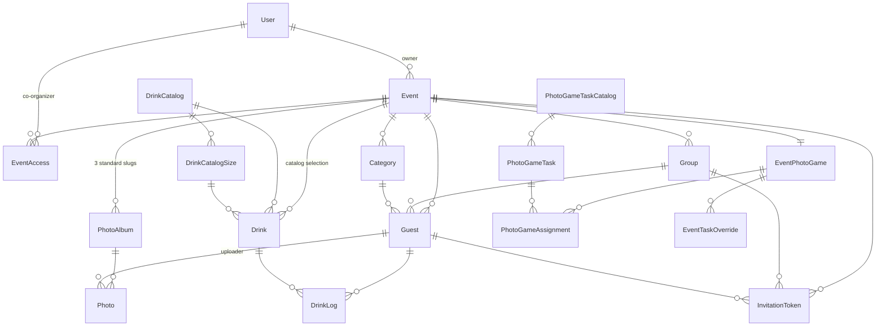

# Architecture

This document explains how the eventplaner is structured — data model, auth layers, and the subsystems around the photo game, drinking game, projector and color theming. The goal is for a reviewer to know after 20–30 minutes of reading where each piece of logic lives and why.

File references use relative paths without line numbers so they don't rot.

---

## 1. Domain model

Everything hangs off an **Event**. A user can own multiple events or have co-organizer access to others; whichever event is currently "active" lives in the session (see §3).



**Photo subsystem** — every event gets three albums with fixed slugs: `app_gallery` (everything the app uploads), `presentation` (material curated by the host in advance) and `photo_game` (submissions from the task game). Missing standard albums are backfilled on demand.

**Drink subsystem** — see §9. A refactor split type and size, which is why there are two catalog tables.

**Photo-game subsystem** — see §4. Global catalogs plus per-event overrides.

---

## 2. Auth layers

Two auth models coexist:

| Actor | Auth mechanism | Storage |
|---|---|---|
| User (owner / admin) | Email + password, session cookies via Sanctum | `App\Models\User` with a `role` column (`admin` = superadmin, otherwise event owner) |
| Guest | Sanctum bearer token via QR login | `App\Models\Guest` is `HasApiTokens`, guard stays `web` |

**Middleware aliases** are registered in `bootstrap/app.php`:

| Alias | Class | Purpose |
|---|---|---|
| `admin` | `App\Http\Middleware\EnsureUserIsAdmin` | Protects `/admin/*` (user management) |
| `has_event` | `App\Http\Middleware\EnsureHasEventAccess` | Protects the main app — user needs access to at least one event |
| `can_administer` | `App\Http\Middleware\EnsureCanAdministerEvent` | Session-event `administer` gate for routes without an `{event}` binding |
| `auth:sanctum` + `EnsureGuestHasAppAccess` | `app/Http/Middleware/EnsureGuestHasAppAccess.php` | API routes that require `app_access=true` on the guest |
| `auth:sanctum` + `EnsureGuestHasDrinksAccess` | `app/Http/Middleware/EnsureGuestHasDrinksAccess.php` | Additional gate for drink tracking |

The QR-login flow is two-step for families — details in [`app/Http/Controllers/Api/QrAuthController.php`](../app/Http/Controllers/Api/QrAuthController.php).

### 2a. Per-event tiers (`EventPolicy`)

Beyond the global `users.role`, each event has a **tier** stored in the `event_user`
pivot (`role`: `owner` | `event_admin` | `event_manager`, default `event_manager`).
Ownership is the primary owner (`events.user_id`) **plus** any pivot `owner` row — all
owners are equal ([`Event::owners()`](../app/Models/Event.php) / `isOwnedBy()`).

- [`User::roleOn(Event)`](../app/Models/User.php) resolves the effective tier
  (precedence: superadmin → owner → event_admin/event_manager), with `canManage()` /
  `canAdminister()` wrappers.
- [`EventPolicy`](../app/Policies/EventPolicy.php) is the project's first policy. Coarse
  abilities `view` / `manage` / `administer` / `manageAccess`; fine-grained,
  target-aware `changeAccess` / `removeMember` / `grantOwner` / `transferOwnership` /
  `deleteEvent`. A `before()` hook short-circuits **only** the coarse abilities for
  superadmins — the fine-grained ones run their own checks so the global admin tier is
  never handed out through an access change.
- **Manage** (all tiers): guests, photos, drinks, games, revocation requests.
  **Administer** (event_admin ∪ owner): deep settings, design, schedule, event access,
  guest deletion, projector config, photo-report adjudication. `routes/web.php` splits
  these; the sprinkled administer routes (projector, schedule-visibility, guest delete)
  are gated per-route with `can_administer`.
- Membership writes go through [`EventAccessService`](../app/Services/EventAccessService.php),
  which enforces the **last-owner invariant** transactionally (`lockForUpdate`), so
  concurrent demote/remove can't race an event down to zero owners.
- Frontend gating uses the shared `active_event.my_role` prop — cosmetic only; the
  policy + service are authoritative.

---

## 3. Active event (session pattern)

A user may have access to multiple events. Which event is currently "active" is **not** passed per request — instead the choice lives in the session.

- The helper [`Controller::activeEvent()`](../app/Http/Controllers/Controller.php) reads `session('active_event_id')` and verifies the event is still accessible. Fallback is the first accessible event.
- [`HandleInertiaRequests::share()`](../app/Http/Middleware/HandleInertiaRequests.php) shares `active_event` and `accessible_events` globally with every Inertia page.
- The sidebar renders a switcher when the user has more than one event; otherwise just the name.

This keeps every controller free of event-id boilerplate — the chosen context comes from the session.

---

## 4. Photo game — delta model

Game mechanic: guests are assigned a random task through the app, photograph the subject, and submit the photo. Tasks should be **globally maintainable**, yet each event should still be able to add its own tweaks — without duplicating the entire list per event.

**Data model**:

- `photo_game_task_catalogs` holds the global catalogs (`event_id = null`):
  - exactly one `is_base = true` (general, always in the pool)
  - multiple type-specific catalogs (`event_type = 'hochzeit' | 'geburtstag' …`)
- `photo_game_tasks` belong to a catalog
- `event_photo_games.catalog_id` points to the type catalog chosen by the event
- `event_task_overrides` stores only deltas per event:
  - `hidden` — task is removed from the pool
  - `modified` — description is replaced
  - `added` — new task, `task_id` is `null`

**Pool building** in [`app/Http/Controllers/Api/PhotoGameController.php`](../app/Http/Controllers/Api/PhotoGameController.php) (`buildAssignPool()`):

1. Load the base catalog
2. Append the type catalog if set
3. Apply overrides (hidden removes, modified replaces, added appends)

**Submissions** — `photo_game_assignments` store either `task_id` or `override_id` (for `added`). Re-submission is allowed: a guest may submit a new photo for the same task. Deleting an assignment also removes the object-storage photo.

---

## 5. Drinking game — score calculation

Guests log drinks; the drinking game ranks them by points. [`app/Services/DrinkScoreService.php`](../app/Services/DrinkScoreService.php) carries all the logic.

**Alcoholic formula**:
```
base = round(amount_liter × alcohol_percent × 10)
```

**Modifiers**:

- **Shot multiplier 2.0** — drinks in the `spirit` category get `×2` because 4 cl neat hit noticeably harder than 4 cl in a long drink.
- **Binge penalty 50%** — after three alcoholic drinks in a row the base score counts at half. Prevents "drink fast" from scaling forever.
- **Non-alcoholic, flat** — water −5, soft drinks −3 (negative `negative_points` values on the catalog). Rewards staying hydrated.

The multipliers are picked empirically, not clinically — the game is entertainment, not a diagnostic tool.

---

## 6. Color system — palette + roles

Every event has a fully configurable theme that feeds both the web app and the React Native companion. The model separates **palette** (the three available colors) from **roles** (which palette color is used for what).

**Palette**:

- `color_primary`, `color_secondary`, `color_tertiary` — three hex values

**Roles** (nine fields, each storing a key `primary | secondary | tertiary`, **not** the hex value):

`role_screen_bg`, `role_card_bg`, `role_card_text`, `role_card_button`, `role_card_button_text`, `role_tab_tint`, `role_border`, `role_fab`, `role_fab_icon`

**Why it's set up this way**: change the palette and every role follows automatically. If hex values were stored directly in the roles, every re-skin would require touching every field. The settings frontend ([`resources/js/pages/Event/Settings.vue`](../resources/js/pages/Event/Settings.vue)) is a slim form + save-bar wrapper; the actual UI is composed from seven sub-components under [`resources/js/components/EventSettings/`](../resources/js/components/EventSettings/) (four simulated phone screens under `PhonePreview/`, plus `VenueEditor.vue`, `ColorSystemEditor.vue`, `CoverUpload.vue`). Each sub-component owns its slice of the event via `defineModel<T>()` per field, so state stays typed end-to-end and the phone previews react live to every palette / role change.

**Cover overlay** — `color_home_text`, `color_home_shadow` and `home_shadow_opacity` are optional and only relevant when a cover image is set.

**Runtime resolution** — the API returns ready-made hex values so clients don't have to resolve themselves: [`app/Http/Controllers/Api/EventInfoController.php`](../app/Http/Controllers/Api/EventInfoController.php) resolves the nine role keys against the palette and emits `color_screen_bg`, `color_card`, … prepared.

---

## 7. Projector subsystem

For the actual party there's a fullscreen slideshow opened on a projector machine. It pulls its data from the app and reacts to new uploads.

- **Public route** — every event has a `projector_token` (auto-generated, regeneratable). The route `/projector/{token}` is accessible without login because the projector machine has no user account.
- **Auto-poll** every 10 seconds for new photos, **crossfade** 5 seconds between images.
- **Contextual label** depending on the album slug:
  - `app_gallery` — guest name; mode configurable (`first | full | none` via `projector_name_mode`)
  - `presentation` — optional description on the photo
  - `photo_game` — task text from the assignment

Frontend lives in [`resources/js/pages/Projector/Show.vue`](../resources/js/pages/Projector/Show.vue), backend in [`app/Http/Controllers/ProjectorController.php`](../app/Http/Controllers/ProjectorController.php).

---

## 8. i18n — front- and backend

**Frontend** — vue-i18n v11. Locale files live under [`resources/js/locales/de.json`](../resources/js/locales/de.json) and `en.json`. The language is persisted to `localStorage`, default German. Plugin initialization in [`resources/js/plugins/i18n.ts`](../resources/js/plugins/i18n.ts). Nav and tab arrays are intentionally defined as `computed()` so they react to language switches.

**Backend** — localization happens **inline** in the API controllers that return i18n content. The request header is parsed with Laravel's standard helper:

```php
$lang = $request->getPreferredLanguage(['de', 'en']);
```

Used in [`app/Http/Controllers/Api/PhotoGameController.php`](../app/Http/Controllers/Api/PhotoGameController.php) and [`app/Http/Controllers/Api/DrinkLogController.php`](../app/Http/Controllers/Api/DrinkLogController.php). There's intentionally no separate locale middleware — the two endpoints involved don't justify a global mechanism.

---

## 9. Drink catalog — data model

Before the refactor, every size (0.3 l pils / 0.5 l pils / …) required its own catalog row — type and size were mixed. That made both the per-event selection and the point calculation messy. Today:

| Table | Purpose |
|---|---|
| `drink_catalog` | one row per type (pils, wheat beer, water, …) — no sizes anymore |
| `drink_catalog_sizes` | `(catalog_id, amount_liter, is_default)` — N sizes per type |
| `drinks` | `(event_id, drink_catalog_id, size_id)` — event picks individual sizes |
| `drink_logs` | `guest_id`, `drink_id`, `size_id`, `amount_liter` (denormalized for historical stability) |

The denormalized `amount_liter` in `drink_logs` is intentional: if the default size of a type changes later, historic points stay untouched.

Models: [`app/Models/DrinkCatalog.php`](../app/Models/DrinkCatalog.php), [`app/Models/DrinkCatalogSize.php`](../app/Models/DrinkCatalogSize.php), [`app/Models/Drink.php`](../app/Models/Drink.php), [`app/Models/DrinkLog.php`](../app/Models/DrinkLog.php).

---

## 10. Deploy pipeline

Three branches, two Dockerfiles:

```
develop  →  staging  →  production
```

- `develop` runs with [`Dockerfile`](../Dockerfile) (artisan serve, port 8080) — fast iteration.
- `staging` and `production` run with [`Dockerfile.prod`](../Dockerfile.prod) (nginx + php-fpm).
- [`docker-compose.yml`](../docker-compose.yml) is **branch-specific** and intentionally not overwritten on merge — otherwise the setup falls apart depending on the target.

Coolify deploys automatically on push, migrations run on container start.

---

## Further reading

- [`README.md`](../README.md) — project pitch, feature highlights, quick start
- [`docs/GDPR_COMPLIANCE_PLAN.md`](GDPR_COMPLIANCE_PLAN.md) — GDPR / data-protection plan and stage breakdowns
- [`docs/legal/sub-processors.md`](legal/sub-processors.md) — sub-processor register (Hetzner, Resend, …)
- [`CLAUDE.md`](../CLAUDE.md) — internal collaboration instructions for the AI pair partner (German)
