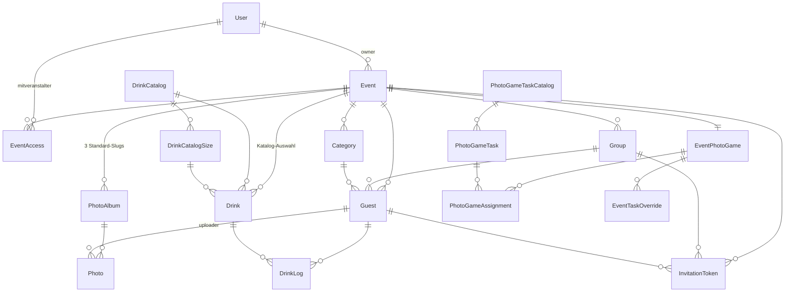

# Architektur

Dieses Dokument erklärt, wie der Eventplaner aufgebaut ist — Datenmodell, Auth-Schichten, die Subsysteme rund um Fotospiel, Trinkspiel, Projektor und Farben. Ziel ist ein Reviewer, der nach 20–30 Minuten Lesen weiß, wo welche Logik liegt und warum.

Die Datei verweist auf Quellen mit relativen Pfaden ohne Zeilennummern, damit Verweise nicht verrotten.

---

## 1. Domänenmodell

Alles hängt an einem **Event**. Ein User kann mehrere Events besitzen oder als Mitveranstalter Zugriff auf weitere haben; das jeweils aktive Event lebt in der Session (siehe §3).



**Foto-Subsystem** — pro Event werden drei Alben mit festen Slugs angelegt: `app_gallery` (alles was die App hochlädt), `presentation` (vorab vom Veranstalter kuratiertes Material) und `photo_game` (Einreichungen aus dem Aufgaben-Spiel). Fehlende Standard-Alben werden bei Bedarf nachgeholt (Backfill).

**Drink-Subsystem** — siehe §9. Ein Refactor hat Typ und Größe getrennt, daher die zwei Catalog-Tabellen.

**Fotospiel-Subsystem** — siehe §4. Globale Kataloge plus Event-spezifische Overrides.

---

## 2. Auth-Schichten

Es gibt zwei Auth-Modelle, die nebeneinander leben:

| Akteur | Auth-Mechanismus | Verwaltung |
|---|---|---|
| User (Owner / Admin) | Email + Passwort, Session-Cookies via Sanctum | `App\Models\User` mit `role`-Spalte (`admin` = Superadmin, sonst Event-Owner) |
| Gast | Sanctum-Bearer-Token via QR-Login | `App\Models\Guest` ist `HasApiTokens`, Guard bleibt `web` |

**Middleware-Aliase** sind in `bootstrap/app.php` registriert:

| Alias | Klasse | Zweck |
|---|---|---|
| `admin` | `App\Http\Middleware\EnsureUserIsAdmin` | Schützt `/admin/*` (User-Verwaltung) |
| `has_event` | `App\Http\Middleware\EnsureHasEventAccess` | Schützt die Hauptapp — User braucht mindestens ein zugängliches Event |
| `auth:sanctum` + `EnsureGuestHasAppAccess` | `app/Http/Middleware/EnsureGuestHasAppAccess.php` | API-Routen, die ein `app_access=true` auf dem Gast erfordern |
| `auth:sanctum` + `EnsureGuestHasDrinksAccess` | `app/Http/Middleware/EnsureGuestHasDrinksAccess.php` | Zusätzliche Schranke für Getränke-Tracking |

Der QR-Login-Flow ist zweistufig für Familien — Details in [`app/Http/Controllers/Api/QrAuthController.php`](../app/Http/Controllers/Api/QrAuthController.php).

---

## 3. Aktives Event (Session-Pattern)

Ein User kann Zugriff auf mehrere Events haben. Welches Event gerade „aktiv" ist, wird **nicht** pro Request übergeben — stattdessen liegt die Wahl in der Session.

- Helper [`Controller::activeEvent()`](../app/Http/Controllers/Controller.php) liest `session('active_event_id')` und prüft, ob das Event noch zugänglich ist. Fallback ist das erste zugängliche Event.
- [`HandleInertiaRequests::share()`](../app/Http/Middleware/HandleInertiaRequests.php) teilt `active_event` und `accessible_events` global an alle Inertia-Seiten.
- Die Sidebar zeigt bei mehr als einem Event einen Switcher; sonst nur den Namen.

So bleibt jeder Controller frei von Event-ID-Boilerplate — der gewählte Kontext kommt aus der Session.

---

## 4. Fotospiel — Delta-Modell

Das Spielprinzip: Gäste bekommen über die App eine zufällige Aufgabe zugewiesen, fotografieren das Motiv und reichen das Foto ein. Aufgaben sollen **global pflegbar** sein, aber jedes Event soll trotzdem eigene Anpassungen vornehmen können — ohne pro Event die ganze Liste zu duplizieren.

**Datenmodell**:

- `photo_game_task_catalogs` enthält die globalen Kataloge (`event_id = null`):
  - genau ein `is_base = true` (Allgemein, immer im Pool)
  - mehrere typ-spezifische Kataloge (`event_type = 'hochzeit' | 'geburtstag' …`)
- `photo_game_tasks` hängen an einem Katalog
- `event_photo_games.catalog_id` zeigt auf den gewählten Typ-Katalog des Events
- `event_task_overrides` speichert pro Event nur Deltas:
  - `hidden` — Task wird im Pool ausgeblendet
  - `modified` — Description wird ersetzt
  - `added` — neue Task, `task_id` ist `null`

**Pool-Aufbau** in [`app/Http/Controllers/Api/PhotoGameController.php`](../app/Http/Controllers/Api/PhotoGameController.php) (`buildAssignPool()`):

1. Base-Katalog laden
2. Typ-Katalog anhängen, falls gesetzt
3. Overrides anwenden (hidden entfernt, modified ersetzt, added angehängt)

**Einreichungen** — `photo_game_assignments` speichern `task_id` oder `override_id` (für `added`). Re-Submission ist erlaubt: ein Gast kann ein neues Foto für dieselbe Aufgabe einreichen. Beim Löschen eines Assignments wird das R2-Foto mit aufgeräumt.

---

## 5. Trinkspiel — Score-Berechnung

Gäste loggen Getränke; das Trinkspiel sortiert sie nach Punkten. [`app/Services/DrinkScoreService.php`](../app/Services/DrinkScoreService.php) trägt die gesamte Logik.

**Formel alkoholisch**:
```
basis = round(amount_liter × alcohol_percent × 10)
```

**Modifikatoren**:

- **Shot-Multiplier 2.0** — Drinks der Kategorie `spirit` werden mit `×2` versehen, weil 4 cl pur deutlich schneller wirken als 4 cl im Longdrink.
- **Binge-Penalty 50 %** — ab drei alkoholischen Drinks in Folge zählt der Basis-Score halb. Verhindert, dass „schnelles Trinken" beliebig skaliert.
- **Alkoholfrei flat** — Wasser −5, Softdrinks −3 (negative `negative_points`-Werte am Katalog). Belohnt das Mitdenken.

Die Multiplikatoren sind empirisch gewählt, nicht klinisch — das Spiel ist Unterhaltung, kein Diagnose-Tool.

---

## 6. Farbsystem — Palette + Rollen

Jedes Event hat ein vollständig konfigurierbares Theme, das sowohl die Web-App als auch die React-Native-App speist. Die Modellierung trennt **Palette** (die drei verfügbaren Farben) von **Rollen** (welche Palette-Farbe wofür verwendet wird).

**Palette**:

- `color_primary`, `color_secondary`, `color_tertiary` — drei Hex-Werte

**Rollen** (neun Felder, jedes speichert einen Key `primary | secondary | tertiary`, **nicht** den Hex-Wert):

`role_screen_bg`, `role_card_bg`, `role_card_text`, `role_card_button`, `role_card_button_text`, `role_tab_tint`, `role_border`, `role_fab`, `role_fab_icon`

**Warum so**: Ändert man die Palette, folgen automatisch alle Rollen. Wer stattdessen Hex-Werte direkt in den Rollen speichert, müsste bei einem Skin-Wechsel jede einzelne Stelle nachziehen. Das Settings-Frontend ([`resources/js/pages/Event/Settings.vue`](../resources/js/pages/Event/Settings.vue)) zeigt vier simulierte Smartphone-Screens, die live auf jede Änderung reagieren.

**Cover-Overlay** — `color_home_text`, `color_home_shadow` und `home_shadow_opacity` sind optional und nur relevant, wenn ein Cover-Bild gesetzt ist.

**Auflösung zur Laufzeit** — die API gibt fertige Hex-Werte zurück, damit Clients nicht selbst auflösen müssen: [`app/Http/Controllers/Api/EventInfoController.php`](../app/Http/Controllers/Api/EventInfoController.php) löst die neun Rollen-Keys gegen die Palette auf und schickt `color_screen_bg`, `color_card`, … fertig vorbereitet raus.

---

## 7. Projektor-Subsystem

Für die Feier selbst gibt es eine Vollbild-Diashow, die auf einem Beamer-Rechner geöffnet wird. Sie zieht ihre Daten aus der App und reagiert auf neue Uploads.

- **Public-Route** — pro Event existiert ein `projector_token` (auto-generiert, regenerierbar). Die Route `/projector/{token}` ist ohne Login zugänglich, weil der Projektor-Rechner kein User-Konto hat.
- **Auto-Poll** alle 10 Sekunden auf neue Fotos, **Crossfade** 5 Sekunden zwischen Bildern.
- **Kontextuelles Label** abhängig vom Album-Slug:
  - `app_gallery` — Gastname; Modus konfigurierbar (`first | full | none` via `projector_name_mode`)
  - `presentation` — optionale Beschreibung am Foto
  - `photo_game` — Aufgabentext des Assignments

Frontend liegt in [`resources/js/pages/Projector/Show.vue`](../resources/js/pages/Projector/Show.vue), Backend in [`app/Http/Controllers/ProjectorController.php`](../app/Http/Controllers/ProjectorController.php).

---

## 8. i18n — Front- und Backend

**Frontend** — vue-i18n v11. Locale-Dateien liegen unter [`resources/js/locales/de.json`](../resources/js/locales/de.json) und `en.json`. Sprache wird in `localStorage` gespeichert, Default Deutsch. Plugin-Init in [`resources/js/plugins/i18n.ts`](../resources/js/plugins/i18n.ts). Nav- und Tab-Arrays sind bewusst als `computed()` definiert, damit sie auf Sprachwechsel reagieren.

**Backend** — Lokalisierung passiert **inline** in den API-Controllern, die i18n-Inhalt zurückgeben. Der Request-Header wird über Laravels Standard-Helper ausgewertet:

```php
$lang = $request->getPreferredLanguage(['de', 'en']);
```

Genutzt in [`app/Http/Controllers/Api/PhotoGameController.php`](../app/Http/Controllers/Api/PhotoGameController.php) und [`app/Http/Controllers/Api/DrinkLogController.php`](../app/Http/Controllers/Api/DrinkLogController.php). Es gibt bewusst keine separate Locale-Middleware — die zwei betroffenen Endpoints rechtfertigen den globalen Mechanismus nicht.

---

## 9. Drink-Catalog — Datenmodell

Vor dem Refactor war pro Größe (0,3 l Pils / 0,5 l Pils / …) eine eigene Katalog-Zeile nötig — Typ und Größe waren vermischt. Das machte sowohl die Auswahl im Event als auch Punkt-Berechnungen unsauber. Heute:

| Tabelle | Zweck |
|---|---|
| `drink_catalog` | eine Zeile pro Typ (Pils, Weißbier, Wasser, …) — keine Sizes mehr |
| `drink_catalog_sizes` | `(catalog_id, amount_liter, is_default)` — pro Typ N Größen |
| `drinks` | `(event_id, drink_catalog_id, size_id)` — Event wählt einzelne Sizes |
| `drink_logs` | `guest_id`, `drink_id`, `size_id`, `amount_liter` (denormalisiert für historische Stabilität) |

Die denormalisierte `amount_liter` in `drink_logs` ist Absicht: ändert sich später die Default-Größe eines Typs, bleiben alte Punkte unverändert.

Models: [`app/Models/DrinkCatalog.php`](../app/Models/DrinkCatalog.php), [`app/Models/DrinkCatalogSize.php`](../app/Models/DrinkCatalogSize.php), [`app/Models/Drink.php`](../app/Models/Drink.php), [`app/Models/DrinkLog.php`](../app/Models/DrinkLog.php).

---

## 10. Deploy-Pipeline

Drei Branches, zwei Dockerfiles:

```
develop  →  staging  →  production
```

- `develop` läuft mit [`Dockerfile`](../Dockerfile) (artisan-serve, Port 8080) — schnelle Iteration.
- `staging` und `production` laufen mit [`Dockerfile.prod`](../Dockerfile.prod) (nginx + php-fpm).
- [`docker-compose.yml`](../docker-compose.yml) ist **branch-spezifisch** und wird beim Merge bewusst nicht überschrieben — sonst zerlegt sich das Setup je nach Ziel.

Coolify deployt automatisch beim Push, Migrations laufen beim Container-Start.

---

## Weiterlesen

- [`README.md`](../README.md) — Projekt-Pitch, Feature-Highlights, Quick Start
- [`docs/SHOWCASE_PLAN.md`](SHOWCASE_PLAN.md) — Plan für Tests, CI, Coverage
- [`CLAUDE.md`](../CLAUDE.md) — interne Arbeitsanweisungen für den AI-Pair-Partner
